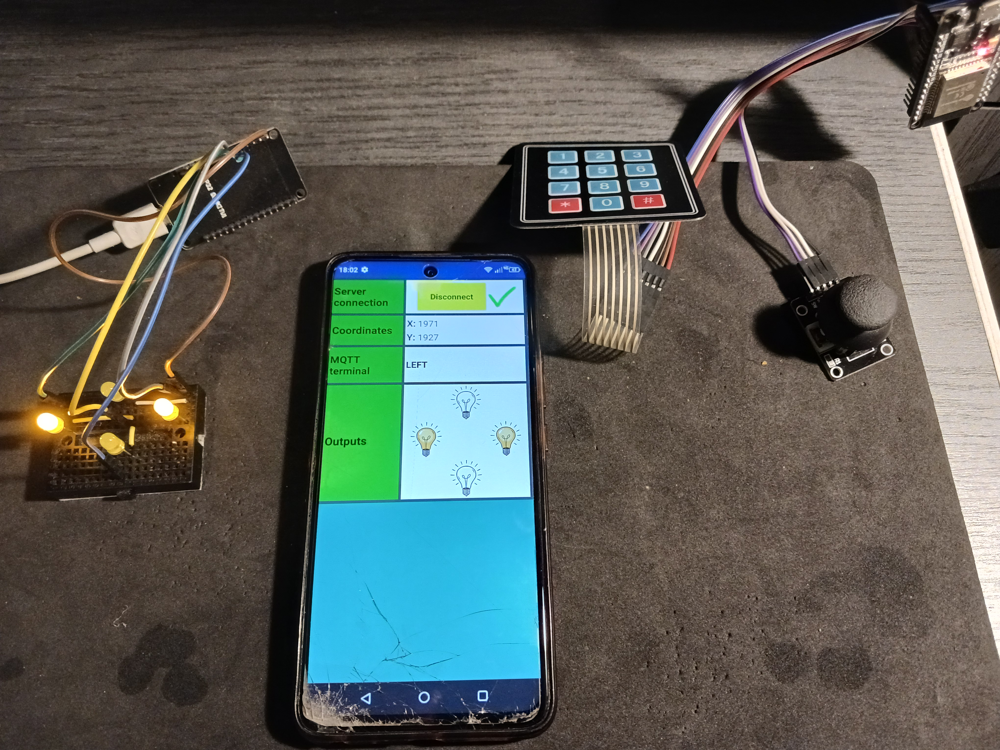

# About project 

The purpose of the project was creating a server android application for two esp32 working separately to enable their communication in any chosen moment. This way we exlude situation in which someone could possibly influence on our esp32 (the one with diodes). It's still possible if someone knows the specific topic and strings, but we can confess it's impossible without sharing the code.  

